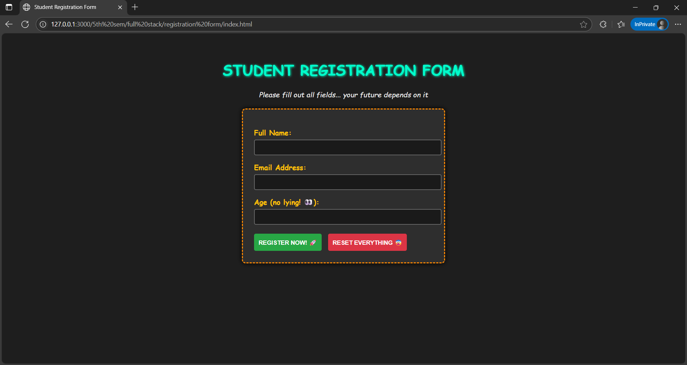

# Registration-form
This is a simple HTML-based Student Registration Form. The form collects basic details such as name, email, and age. It is styled using inline CSS to provide a centered and visually appealing layout.

# Features 
HTML5 form with validation (required, pattern, etc.)

Silly and fun dark theme

Basic input fields: Name, Email, Age

# Technologies Used
HTML5

CSS3 (external stylesheet)

# Screenshot

# File Structure
/registration-form
│
├── index.html         # Main HTML form file
├── style.css          # External CSS for styling
└── README.md          # This file

#  How to Run It
Clone the repo or download the ZIP
git clone https://github.com/your-username/Registration-form.git

Open the folder

Double-click index.html or open it in your browser

